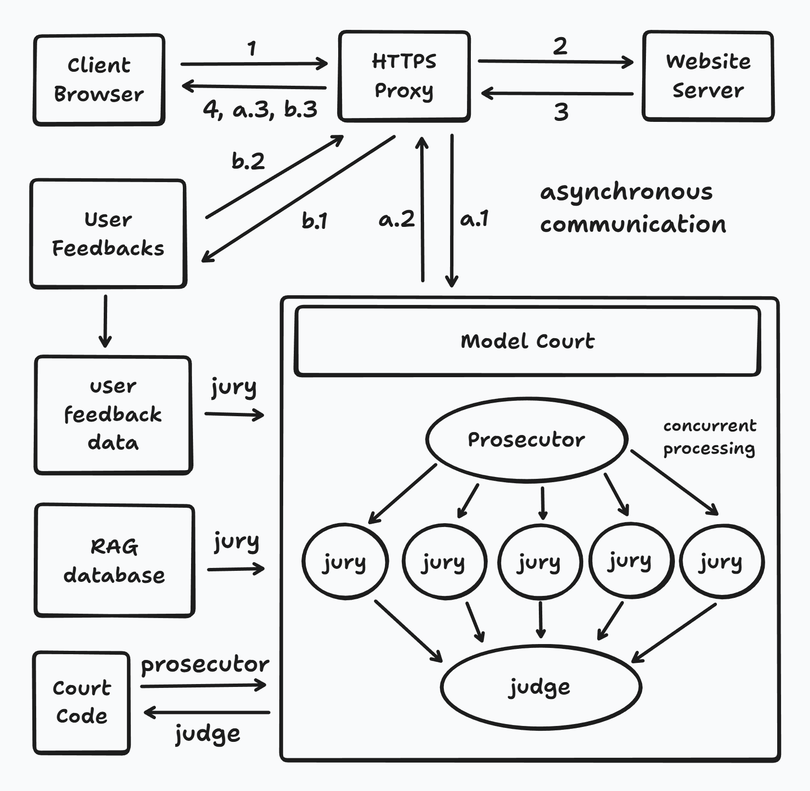
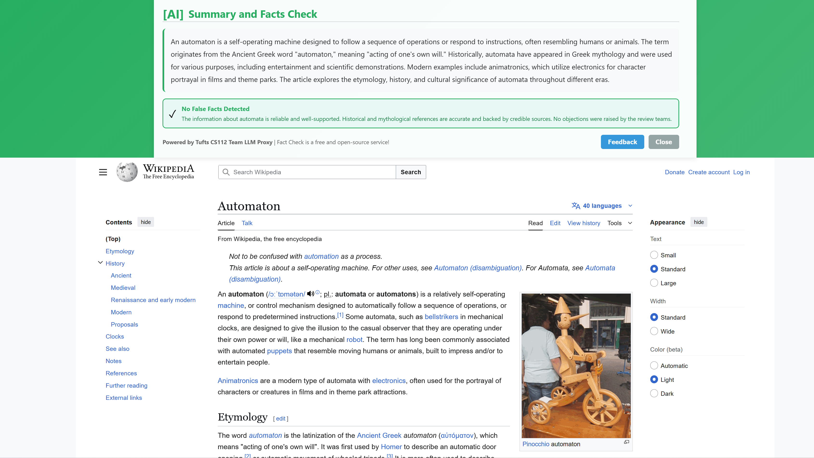
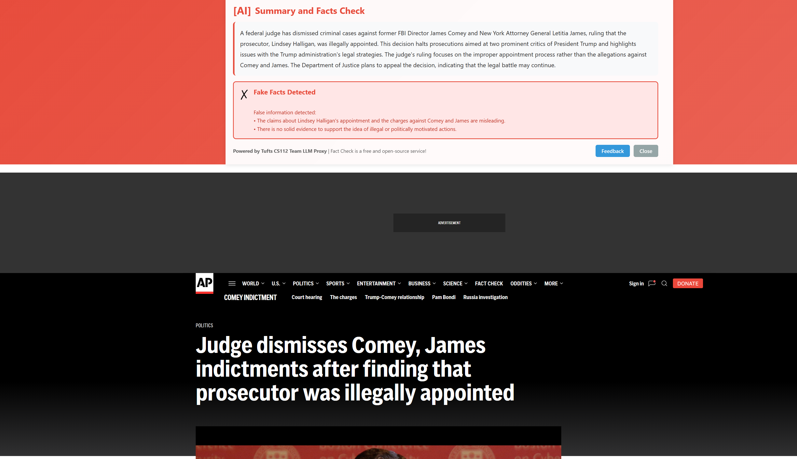
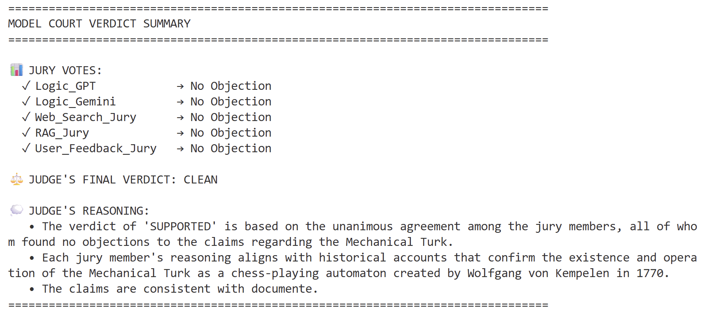
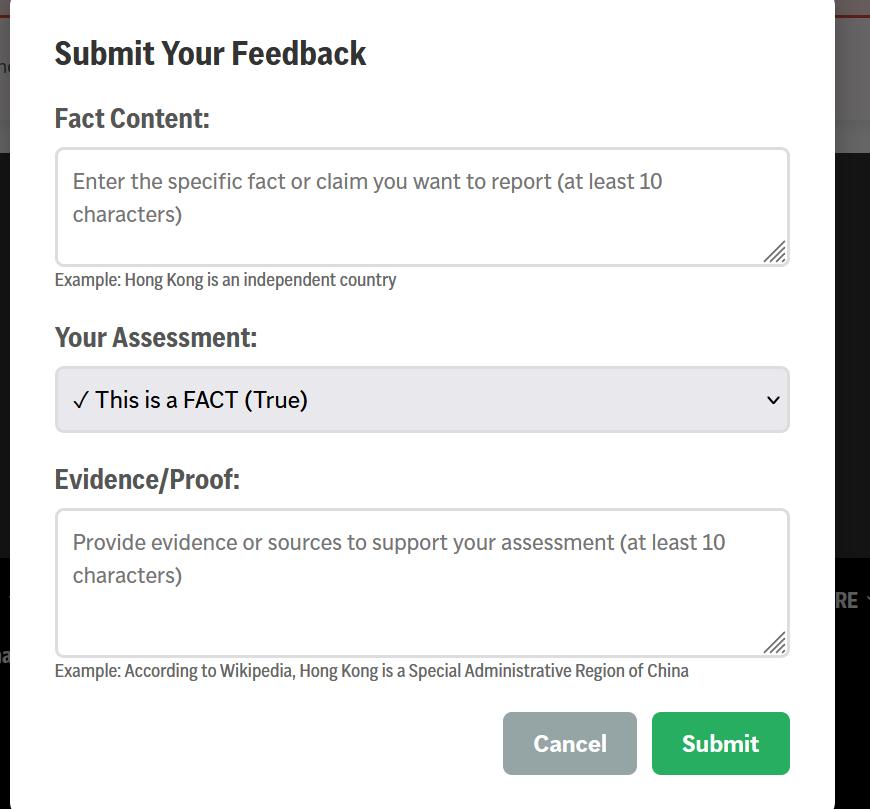
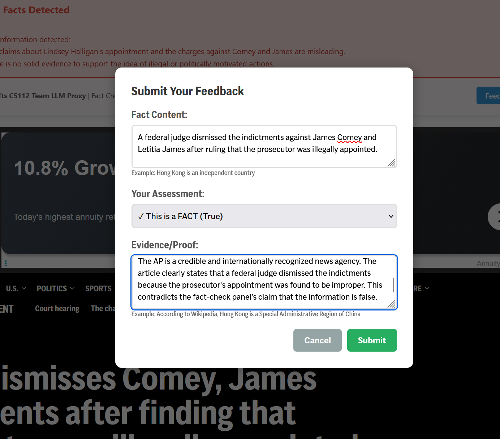
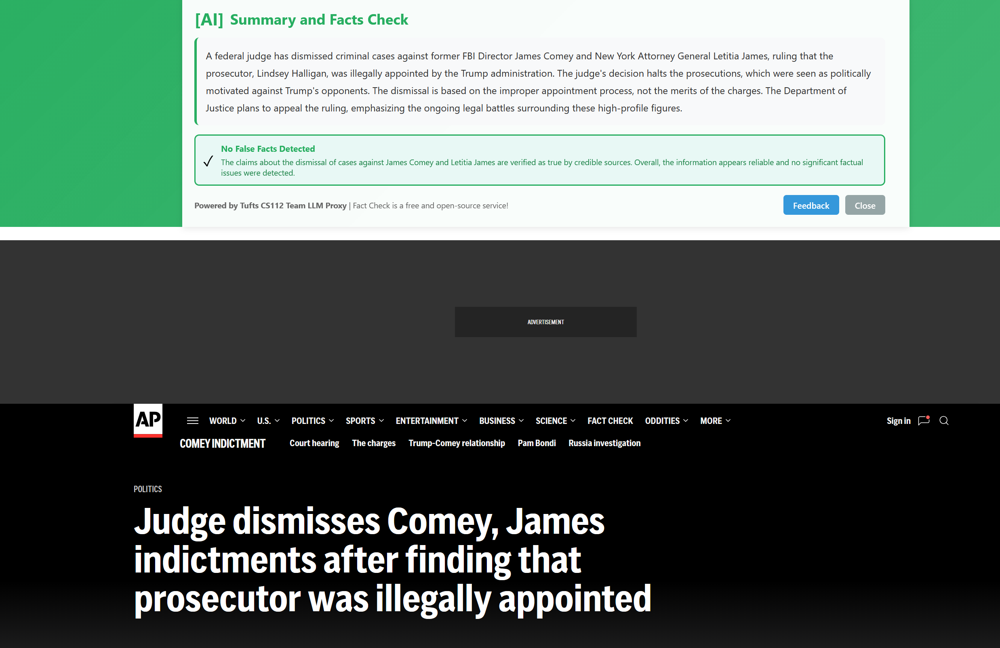

# Fake News Check

This is a project based on llm and HTTPS proxy.

I will add more details later.

## Introduction



The user interaction module is now in discussion and design stage.

The plan is to allow users to click "Fake" or "Real", and maintain a simple community of fact checks.

But the fact check should based on the content or the website? This is still in discussion and will update in later versions.

## Quick Start

Make sure you have already set up the LLM API keys and make c file.

Make sure you have already set up the browser or testing environment.

For HTTPS proxy server: (Recommended Settings)

```bash
# Use LLM server.
./proxy 8080 proxy_ca.crt proxy_ca.key llm=true

# Don't use LLM server and will only inject info on headers.
# This is for testing proxy program to see if it is running correctly.
./proxy 8080 proxy_ca.crt proxy_ca.key llm=false
```

For LLM server:

```bash
# Normal Mode（Port: 5000）
python3 fake_news.py

# Test Mode（Independent test，don't need proxy，auto load fake_news_test.txt）
python3 fake_news.py test
```

For Model Court:

You need install model court firstly. I have packaged model court as a python package, you can find:

* pip package: [https://pypi.org/project/model-court/](https://pypi.org/project/model-court/)
* repo: [https://github.com/LogicGate-AI-Lab/model-court](https://github.com/LogicGate-AI-Lab/model-court)

.

## Fact Check Overview

Use Factcheck HTTPS proxy, you can find there is a framework on the top of the website, and give you feedbacks on the page's content.



If there is suspecious content included, it will became orange:


If there are more suspecious content included, it will became red, the judgement rules are based on model court, which will be introducted later.



## Model Court

Model Court is a llm-as-judge model that use several llms to cross validation. This is comprehensive so we have built this part into a python package.

You can find more information through:
* pip package: [https://pypi.org/project/model-court/](https://pypi.org/project/model-court/)
* repo: [https://github.com/LogicGate-AI-Lab/model-court](https://github.com/LogicGate-AI-Lab/model-court)

In Fact Check, we set up five llms to judge the fact:



The judgement is through following steps: (More details please see the package model-court)

1. The prosecutor will check if this content is already in the court code. If already exist and still valid, then this content will not be judged through model court.

2. If the content is not judged before, then this case will go into the court. Five juries will independtly give their decisions. The jury will give:

- no_objection: there is no fact looks like false
- suspicious_fact: there is some suspeicous fact but has no solid prove
- reasonable_doubt: high possibly false
- obstain: the jury face network or any other problem, or cannot judge so give up

3. The judge will conduct all juries' decisions and finish the case. The verdict only output when there are at least three juries' decisions. The verdict rule is:

- CLEAN: No objection
- SUSPICIOUS: 1-2 objections
- REFUTED: 3 or more objections

4. The Fact Check will give feedback based on the court:

CLEAN:
- The judge's verdict is CLEAN.
- Verdict contain only 1 objection, and rag/text is no_objection.

SUSPICIOUS:
- The judge's verdict is SUSPICIOUS.

FAKE:
- The judge's verdict is REFUTED.

## Human Feedback

If there is misled fact check result, the one who knows the truth can give feedbacks:



For example, this news is true but the Fact Check think it is false:


The system employs a relatively strict trial mechanism because judging a genuine error as having a false impact is less important than judging a false error as having a genuine impact. This is also a characteristic of the legal principle of "presumption of innocence."

But if one is very confident on the result, he can input his prove:



Then click submit. This result will be recorded. Staff can review this feedback. Let's assume the feedback is genuine and valid. 

Now, let's refresh the page again.



This webpage became CLEAN. We gave higher weight to The Archivist Jury (querying RAG) and The Community Watch Jury (querying user feedback). For example, if a jury gives a decision that is not no_objection, but The Archivist Jury and The Community Watch Jury find no problems after reviewing it, we will adjust the final result to CLEAN.